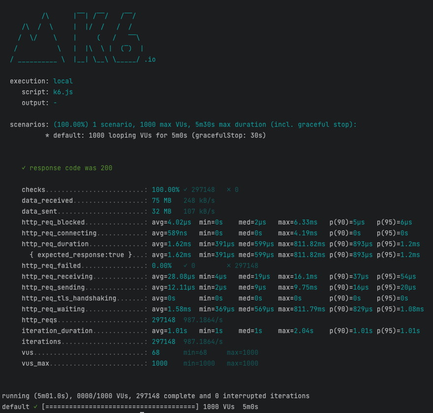

# Google-like short description
Implementation of a microservice to produce a google-like short description of a person.



## 👨‍💻 Full list what has been used:
* [x] [gin](https://github.com/gin-gonic/gin) - HTTP web framework
* [x] [configor](https://github.com/jinzhu/configor) - Golang Configuration tool that support YAML, JSON, TOML, Shell Environment.
* [x] [go-redis](https://github.com/go-redis/redis) - Type-safe Redis client for Golang
* [x] [zap](https://github.com/uber-go/zap) - Logger
* [x] [dig](https://github.com/uber-go/dig) - A reflection based dependency injection toolkit for Go.
* [x] [gin-swagger](https://github.com/swaggo/gin-swagger) - Gin Swagger
* [x] [testify](https://github.com/stretchr/testify) - Testing toolkit
* [x] [gomock](https://github.com/golang/mock) - Mocking framework
* [x] [Docker](https://www.docker.com/) - Docker

## Prerequisites

You will need :

- **Go 1.20**
- **Docker Desktop / Docker Compose**

## Quick start

### Run the server

```shell
make run-server
```
### Cleanup
```shell
make clean
```
***

## Useful commands

```shell
make tests
make build
make run-server # to run the server
make k6 # To simulate multiple requests in the same time using k6
```


## Instructions to run the application using Docker
To start the application on localhost, follow these steps:

- Start the Docker container
```shell
make run-server
```

> Note that the application listens on port 8080, so make sure that this port is available on your localhost.

Additionally, the makefile provides other targets for running tests, generating coverage reports, running linters, and simulating multiple requests using k6.

## Choices and Assumptions Made During Development
During development of this microservice, I made the following choices and assumptions:

- I chose to use the Gin framework for the server-side implementation, as it is fast, efficient, and easy to use.
- I chose to use the **Configor** library for configuration management, as it supports multiple configuration file formats and environment variables.
- I chose to use the **go-redis** library as a type-safe Redis client for data caching and persistence.
- I chose to use the **Zap** library for logging, as it provides a performant and configurable logging system.
- I used the **Dig** library for dependency injection, as it provides a flexible and type-safe way of managing dependencies.
- I chose to use the **Gin Swagger** library for generating Swagger documentation, as it integrates well with Gin and provides a user-friendly interface for exploring and interacting with the API.
- I used the **Testify** library for testing, as it provides a comprehensive toolkit for writing and running tests.
- I used the **Gomock** library for mocking and stubbing in tests, as it provides a powerful and easy-to-use mocking framework.

## Endpoints
### Health Check
`GET /health`: Returns a JSON object indicating the health status of the microservice.
### WikiMedia short description
- `GET /search`: Produce a google-like short description of a person .
### Prometheus metrics
- `GET /metrics`: Provide Prometheus metrics endpoint.
### Swagger UI
- `GET /swagger/index.html`: Returns the Swagger UI page, which provides a user-friendly interface for exploring and interacting with the API.

> To view the Swagger UI for this microservice, [click here](http://localhost:8080/swagger/index.html) after starting the application on your local machine or by accessing the appropriate URL on your deployment environment.

## Possible Extensions and Improvements
Assuming this microservice is deployed to production and tasked with handling a larger volume of requests, the following extensions and improvements can be considered:
- **Scalability**: To improve scalability, the microservice can be deployed on a container orchestration platform like Kubernetes. Autoscaling can be configured to automatically add or remove replicas based on traffic patterns or other metrics. Additionally, a load balancer can be used to distribute traffic across the replicas.
- **Logging and Tracing**: To improve observability, logging and tracing can be added to the microservice. A distributed tracing system like Jaeger or Zipkin can be used to track requests across different microservices. The OpenTelemetry framework can be used to instrument the microservice and send traces to the tracing system. Additionally, structured logging can be added to provide more context and insights into the microservice's behavior.
- **Security**: To improve security, the microservice can be configured to use HTTPS instead of HTTP. Additionally, authentication and authorization mechanisms can be added to restrict access to the microservice's endpoints. Secrets management can be used to securely store sensitive information like API keys or database credentials.
- **API Gateway**: To improve manageability and security, an API gateway can be used to handle requests to the microservice. The API gateway can provide features like rate limiting, authentication, and caching. Additionally, the API gateway can be used to aggregate requests to multiple microservices and provide a unified API to clients.
